# genetic-programming-for-simbolyc-regression

'''mermaid

    graph TD;
        A[Start] --> B[Initialize Population];
        B --> C[Evaluate Fitness];
        C --> D{Termination Condition};
        D -- Yes --> E[Return Best Individual];
        D -- No --> F[Selection];
        F --> G[Crossover];
        G --> H[Mutation];
        H --> B;
'''
# Genetic Programming for Symbolic Regression
This repository contains a Python implementation of genetic programming for symbolic regression. The code is designed to evolve mathematical expressions that fit a given dataset.

# Diagram of how it works

```mermaid
graph TD
    subgraph Execution Start
        A["Start Script ('if __name__ == '__main__':')"] --> B["Instantiate 'GeneticProgramming' class <br> 'gp_system = GeneticProgramming(...)'"];
        B --> C["Call gp_system.run()"];
    end

    subgraph "GeneticProgramming.run()"
        C --> D["Log Start of Run & Parameters"];
        D --> E["Call '_initialize_population()'"];
        E --> E_Detail["(Creates diverse trees using Ramped Half-and-Half)"];
        E_Detail --> F{Start Generational Loop <br> 'for gen in 1 to generations'};
        
        subgraph "Generational Loop (for each generation)"
            F --> G["1. Evaluate Fitness"];
            G --> G_Detail["(Loop through each 'individual' in 'self.population')"];
            G_Detail --> G1["Call '_calculate_fitness(individual)'"];
            G1 --> G1_Detail["(Calls 'individual.evaluate(x, y)' for all 49 dataset points, computes MSE)"];
            G1_Detail --> G2["Store (fitness, individual) pairs"];
            
            G2 --> H["2. Sort Population by Fitness"];
            H --> I["3. Update Best Solution"];
            I --> I_Check{"current_best_fitness < best_overall_fitness?"};
            I_Check -- Yes --> I_Update["Update 'best_overall_fitness' & 'best_overall_individual'"];
            I_Check -- No --> J_Log["Log generation stats (best, avg, etc.)"];
            I_Update --> J_Log;
            
            J_Log --> K{"4. Check Termination Criteria"};
            K -- Met: (Fitness <= Threshold) OR (gen == Max Gens) --> L_Break["Break Loop"];
            K -- Not Met --> M["5. Create New Population"];
            
            subgraph "Reproduction Sub-Loop"
                M --> M1["Initialize 'new_population'"];
                M1 --> N["Elitism: Copy 'elitism_count' best individuals to 'new_population'"];
                N --> O{Loop until 'new_population' is full};
                
                O --> P["Select Parent 1 via '_tournament_selection()'"];
                P --> Q["Select Parent 2 via '_tournament_selection()'"];
                
                Q --> R{"random() < crossover_rate?"};
                R -- Yes --> S["Call '_subtree_crossover(p1, p2)' <br> (Returns two new offspring trees)"];
                R -- No --> S_Clone["Offspring = Clones of Parents"];
                S --> T_Offspring;
                S_Clone --> T_Offspring;
                
                T_Offspring --> U{"random() < 'mutation_rate'? (for Offspring 1)"};
                U -- Yes --> V["Call '_point_mutation(offspring1)'"];
                U -- No --> W_MutateO2;
                V --> W_MutateO2;
                
                W_MutateO2 --> X{"random() < 'mutation_rate'? (for Offspring 2)"};
                X -- Yes --> Y["Call '_point_mutation(offspring2)'"];
                X -- No --> Z_AddPop;
                Y --> Z_AddPop;
                
                Z_AddPop --> AA["Add Offspring 1 & 2 to 'new_population'"];
                AA --> O;
            end
            
            O -- Loop Finished --> BB["Replace old 'self.population' with 'new_population'"];
            BB --> F_NextGen["Increment generation counter"];
            F_NextGen --> F;
        end
    end
    
    L_Break --> Z["Call '_log_and_save_results()'"];
    Z --> Z1["Log Final Best Solution Details"];
    Z1 --> Z2["Write 'gp_results.json' for visualiser"];
    Z2 --> Z_End["End of 'run()' method"];
    Z_End --> Z_Final["Log Total Execution Time"];
    Z_Final --> STOP[End Script];

    %% Styling
    style A fill:#f9f,stroke:#333,stroke-width:2px
    style C fill:#f9f,stroke:#333,stroke-width:2px
    style STOP fill:#f9f,stroke:#333,stroke-width:2px
    style L_Break fill:#d9534f,stroke:#333,stroke-width:2px
    style R fill:#f0ad4e,stroke:#333,stroke-width:2px
    style U fill:#f0ad4e,stroke:#333,stroke-width:2px
    style X fill:#f0ad4e,stroke:#333,stroke-width:2px

```

# Report
[Full Report](report.md)